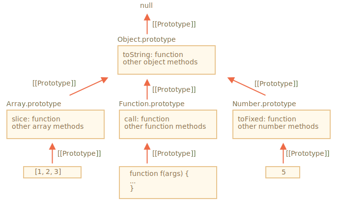
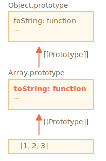

# Встроенные прототипы

Свойство `"prototype"` широко используется в внутри самого языка JavaScript. Все встроенные функции-конструкторы используют его.

Сначала мы посмотрим на детали, а затем используем для добавления встроенным объектам нового функционала.

## Object.prototype

Давайте выведем пустой объект:

```js run
let obj = {};
alert( obj ); // "[object Object]" ?
```

Где код, который генерирует строку `"[object Object]"`? Это встроенный метод `toString`, но где он? `obj` ведь пуст!

...Но краткая нотация `obj = {}` это то же самое, что и `obj = new Object()`, где `Object` - встроенная функция-конструктор для объектов с собственным свойством `prototype`, который ссылается на огромный объект с методом `toString` и другими.

Вот что происходит:


Когда вызывается `new Object()` (или создаётся объект с помощью литерала `{...}`), свойство `[[Prototype]]` этого объекта устанавливается на `Object.prototype` по правилам, который мы обсуждали в предыдущей главе:


Таким образом, когда вызывается `obj.toString()`, метод берётся из `Object.prototype`.

Мы можем проверить это так:

```js run
let obj = {};

alert(obj.__proto__ === Object.prototype); // true
// obj.toString === obj.__proto__.toString == Object.prototype.toString
```

Стоит обратить внимание, что выше `Object.prototype` по цепочке прототипов нет дополнительного свойства `[[Prototype]]`:

```js run
alert(Object.prototype.__proto__); // null
```

## Другие встроенные прототипы

Другие встроенные объекты, такие как `Array`, `Date`, `Function` и другие, также хранят свои методы в прототипах.

Например, когда создаётся массив `[1, 2, 3]`, скрыто используется конструктор по-умолчанию `new Array()`. Так данные массива записываются в новый объект, и прототипом этого объекта становится `Array.prototype`, предоставляя ему свои методы. Это позволяет эффективно использовать память.

Согласно спецификации, наверху иерархии встроенных прототипов находится `Object.prototype`. Иногда говорят, что "все наследуется от объектов".

Вот более полная картина (для 3 встроенных объектов):



Давайте проверим прототипы:

```js run
let arr = [1, 2, 3];

// наследует от Array.prototype?
alert( arr.__proto__ === Array.prototype ); // true

// затем от Object.prototype?
alert( arr.__proto__.__proto__ === Object.prototype ); // true

// и null на вершине иерархии
alert( arr.__proto__.__proto__.__proto__ ); // null
```

Некоторые методы в прототипах могу пересекаться, например, у `Array.prototype` есть свой метод `toString`, который выводит элементы массива через запятую:

```js run
let arr = [1, 2, 3]
alert(arr); // 1,2,3 <-- результат Array.prototype.toString
```

Как мы видели раньше, у `Object.prototype` есть свой метод `toString`, но так как `Array.prototype` ближе в цепочке прототипов, то берётся именно вариант для массивов:





В браузерных инструментах, таких как консоль разработчика в Chrome, можно посмотреть цепочку наследования (возможно, потребуется использовать `console.dir` для встроенных объектов):


Другие встроенные объекты работают таким же способом. Даже функции -- все они объекты встроенного конструктора `Function`, и все их методы (`call`/`apply` и другие) берутся из `Function.prototype`. Также у функций есть свой метод `toString`.

```js run
function f() {}

alert(f.__proto__ == Function.prototype); // true
alert(f.__proto__.__proto__ == Object.prototype); // true, наследует от Object
```

## Примитивы

Самое сложное происходит со строкам, числами и булевым типом.

Как мы помним, они не объекты. Но если мы попытаемся получить доступ к их свойствам, тогда будет создан временный объект-обёртка с использованием встроенных конструкторов `String`, `Number`, `Boolean`, который предоставит методы и после чего исчезнет.

Эти объекты создаются невидимо для нас, и большая часть движков оптимизирует этот процесс, но спецификация описывает это именно таким образом. Методы этих объектов также находятся в прототипах, доступных как `String.prototype`, `Number.prototype` и `Boolean.prototype`.

```warn header="Значения `null` и `undefined` не имеют объектов-обёрток"
Специальные значения `null` и `undefined` стоят особняком. У них нет объектов-обёрток, так что методы и свойства им недоступны. Также у них нет соответствующих прототипов.
```

## Изменение встроенных прототипов [#native-prototype-change]

Встроенные прототипы можно изменять. Например, если добавить метод к `String.prototype`, метод становится доступен для всех строк:

```js run
String.prototype.show = function() {
  alert(this);
};

"BOOM!".show(); // BOOM!
```

В течение процесса разработки у нас могут возникнуть идеи о новых встроенных методах, которые нам хотелось бы иметь, и мы можем испытать искушение добавить их во встроенные прототипы. Это плохая идея.

```warn
Прототипы глобальны, поэтому очень легко могут возникнуть конфликты. Если две библиотеки добавляют методы `String.prototype.show`, то одна из них перепишет другой.

Так что, в общем, изменение встроенных прототипов считается плохой идей.
```

**В современном программировании есть только один случай, в котором одобряется изменение встроенных прототипов. Это создание полифилов.**

Полифил - это термин, который означает замену метода, который существует в спецификации JavaScript, но он ещё не поддерживается текущим движком JavaScript.

Тогда мы можем реализовать его сами и добавить его во встроенный прототип.

Например:

```js run
if (!String.prototype.repeat) { // Если такого метода нет
  // добавляем его в прототип

  String.prototype.repeat = function(n) {
    // повторить строку n раз

    // на самом деле код должен быть немного более сложным
    // (полный алгоритм можно найти в спецификации)
    // но даже неполный полифил часто считается достаточно хорошим
    return new Array(n + 1).join(this);
  };
}

alert( "La".repeat(3) ); // LaLaLa
```


## Заимствование у прототипов

В главе <info:call-apply-decorators#method-borrowing> мы говорили о заимствовании методов.

Это когда мы берём метод из одного объекта и копируем его в другой.

Некоторые методы встроенных прототипов часто одалживают.

Например, если мы создаём объект, похожий на массив (псевдомассив), мы можем скопировать некоторые методы из Array в этот объект.

Пример:

```js run
let obj = {
  0: "Hello",
  1: "world!",
  length: 2,
};

*!*
obj.join = Array.prototype.join;
*/!*

alert( obj.join(',') ); // Hello,world!
```

Это работает, потому что для внутреннего алгоритма встроенного метода `join` важна только корректность индексов и свойства `length`, он не проверяет является ли объект на самом деле массивом. И многие встроенные методы работают так же.

Альтернативная возможность - мы можем унаследовать от массива, установив `obj.__proto__` как `Array.prototype`, таким образом все методы `Array` станут автоматически доступны в `obj`.

Но это будет невозможно, если `obj` уже наследуется от другого объекта. Помните, мы можем наследоваться только от одного объекта одновременно.

Заимствование методов - гибкий способ, позволяющий смешивать функциональность разных объектов по необходимости.

## Итого

- Все встроенные объекты следуют одному шаблону:
    - Методы хранятся в прототипах (`Array.prototype`, `Object.prototype`, `Date.prototype` и т.д.).
    - Сами объекты хранят только данные (элементы массивов, свойства объектов, даты).
- Примитивы также хранят свои методы в прототипах объектах-обёртках: `Number.prototype`, `String.prototype`, `Boolean.prototype`. Только у значений `undefined` и `null` нет объектов-обёрток.
- Встроенные прототипы могут быть изменены или дополнены новыми методами. Но не рекомендуется менять их. Единственная допустимая причина, это когда добавляется новый метод из стандарта, но он ещё не поддерживается движком JavaScript.
