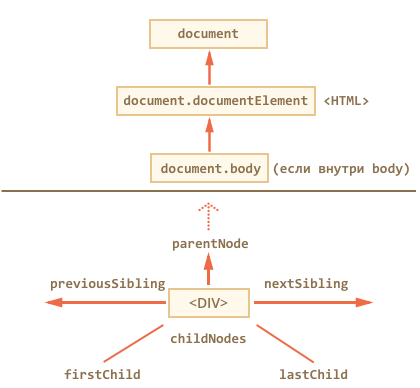
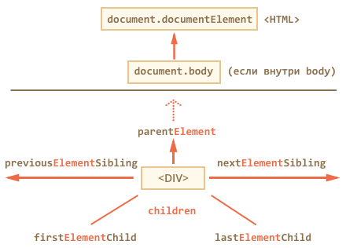

archive:
  ref: dom-navigation
libs:
  - d3
  - domtree

---

# Навигация по DOM-элементам

DOM позволяет делать что угодно с HTML-элементом и его содержимым, но для этого нужно сначала нужный элемент получить.

Доступ к DOM начинается с объекта `document`. Из него можно добраться до любых узлов.

Так выглядят основные ссылки, по которым можно переходить между узлами DOM:



Посмотрим на них повнимательнее.

## Сверху documentElement и body

Самые верхние элементы дерева доступны напрямую из `document`.

`<HTML>` = `document.documentElement`
: Первая точка входа -- `document.documentElement`. Это свойство ссылается на DOM-объект для тега `<html>`.

`<BODY>` = `document.body`
: Вторая точка входа -- `document.body`, который соответствует тегу `<body>`.

В современных браузерах (кроме IE8-) также есть `document.head` -- прямая ссылка на `<head>`

````warn header="Есть одна тонкость: `document.body` может быть равен `null`"
Нельзя получить доступ к элементу, которого еще не существует в момент выполнения скрипта.

В частности, если скрипт находится в `<head>`, то в нём недоступен `document.body`.

Поэтому в следующем примере первый `alert` выведет `null`:

```html run
<!DOCTYPE HTML>
<html>

<head>
  <script>
*!*
    alert( "Из HEAD: " + document.body ); // null, body ещё нет
*/!*
  </script>
</head>

<body>

  <script>
    alert( "Из BODY: " + document.body ); // body есть
  </script>

</body>

</html>
```
````

```smart header="В DOM активно используется `null`"
В мире DOM в качестве значения, обозначающего "нет такого элемента" или "узел не найден", используется не `undefined`, а `null`.
```

## Дети: childNodes, firstChild, lastChild

Здесь и далее мы будем использовать два принципиально разных термина.

- **Дочерние элементы (или дети)** -- элементы, которые лежат *непосредственно* внутри данного. Например, внутри `<HTML>` обычно лежат `<HEAD>` и `<BODY>`.
- **Потомки** -- все элементы, которые лежат внутри данного, вместе с их детьми, детьми их детей и так далее. То есть, всё поддерево DOM.

Псевдо-массив `childNodes` хранит все дочерние элементы, включая текстовые.

Пример ниже последовательно выведет дочерние элементы `document.body`:

```html run
<!DOCTYPE HTML>
<html>

<body>
  <div>Начало</div>

  <ul>
    <li>Информация</li>
  </ul>

  <div>Конец</div>

  <script>
*!*
    for (var i = 0; i < document.body.childNodes.length; i++) {
      alert( document.body.childNodes[i] ); // Text, DIV, Text, UL, ..., SCRIPT
    }
*/!*
  </script>
  ...
</body>

</html>
```

Обратим внимание на маленькую деталь. Если запустить пример выше, то последним будет выведен элемент `<script>`. На самом-то деле в документе есть ещё текст (обозначенный троеточием), но на момент выполнения скрипта браузер ещё до него не дошёл.

Пробельный узел будет в *итоговом документе*, но его еще нет на момент выполнения скрипта.

```warn header="Список детей -- только для чтения!"
Скажем больше -- все навигационные свойства, которые перечислены в этой главе -- только для чтения. Нельзя просто заменить элемент присвоением `childNodes[i] = ...`.

Изменение DOM осуществляется другими методами, которые мы рассмотрим далее, все навигационные ссылки при этом обновляются автоматически.
```

Свойства `firstChild` и `lastChild` обеспечивают быстрый доступ к первому и последнему элементу.

При наличии дочерних узлов всегда верно:
```js
elem.childNodes[0] === elem.firstChild
elem.childNodes[elem.childNodes.length - 1] === elem.lastChild
```

## Коллекции -- не массивы

DOM-коллекции, такие как `childNodes` и другие, которые мы увидим далее, не являются JavaScript-массивами.

В них нет методов массивов, таких как `forEach`, `map`, `push`, `pop` и других.

```js run
var elems = document.documentElement.childNodes;

*!*
elems.forEach(function(elem) { // нет такого метода!
*/!*
  /* ... */
});
```

Именно поэтому `childNodes` и называют "коллекция" или "псевдомассив".

Можно для перебора коллекции использовать обычный цикл `for(var i=0; i<elems.length; i++) ...` Но что делать, если уж очень хочется воспользоваться методами массива?

Это возможно, основных варианта два:

1. Применить метод массива через `call/apply`:

    ```js run
    var elems = document.documentElement.childNodes;

    *!*
    [].forEach.call(elems, function(elem) {
    */!*
      alert( elem ); // HEAD, текст, BODY
    });
    ```
2. При помощи [Array.prototype.slice](https://developer.mozilla.org/en-US/docs/Web/JavaScript/Reference/Global_Objects/Array/slice) сделать из коллекции массив.

    Обычно вызов `arr.slice(a, b)` делает новый массив и копирует туда элементы `arr` с индексами от `a` до `b-1` включительно. Если же вызвать его без аргументов `arr.slice()`, то он делает новый массив и копирует туда все элементы  `arr`.

    Это работает и для коллекции:

    ```js run
    var elems = document.documentElement.childNodes;
    *!*
    elems = Array.prototype.slice.call(elems); // теперь elems - массив
    */!*

    elems.forEach(function(elem) {
      alert( elem.tagName ); // HEAD, текст, BODY
    });
    ```

````warn header="Нельзя перебирать коллекцию через `for..in`"
Ранее мы говорили, что не рекомендуется использовать для перебора массива цикл `for..in`.

**Коллекции -- наглядный пример, почему нельзя. Они похожи на массивы, но у них есть свои свойства и методы, которых в массивах нет.**

К примеру, код ниже должен перебрать все дочерние элементы `<html>`. Их, естественно, два: `<head>` и `<body>`. Максимум, три, если взять ещё и текст между ними.

Но в примере ниже `alert` сработает не три, а целых 5 раз!

```js run
var elems = document.documentElement.childNodes;

for (var key in elems) {
  alert( key ); // 0, 1, 2, length, item
}
```

Цикл `for..in` выведет не только ожидаемые индексы `0`, `1`, `2`, по которым лежат узлы в коллекции, но и свойство `length` (в коллекции оно enumerable), а также функцию `item(n)` -- она никогда не используется, возвращает `n-й` элемент коллекции, проще обратиться по индексу `[n]`.

В реальном коде нам нужны только элементы, мы же будем работать с ними, а служебные свойства -- не нужны. Поэтому желательно использовать `for(var i=0; i<elems.length; i++)`.
````

## Соседи и родитель

Доступ к элементам слева и справа данного можно получить по ссылкам `previousSibling` / `nextSibling`.

Родитель доступен через `parentNode`. Если долго идти от одного элемента к другому, то рано или поздно дойдёшь до корня DOM, то есть до `document.documentElement`, а затем и `document`.

## Навигация только по элементам

Навигационные ссылки, описанные выше, равно касаются всех узлов в документе. В частности, в `childNodes` сосуществуют и текстовые узлы и узлы-элементы и узлы-комментарии, если есть.

Но для большинства задач текстовые узлы нам не интересны.

Поэтому посмотрим на дополнительный набор ссылок, которые их не учитывают:



Эти ссылки похожи на те, что раньше, только в ряде мест стоит слово `Element`:

- `children` -- только дочерние узлы-элементы, то есть соответствующие тегам.
- `firstElementChild`, `lastElementChild` -- соответственно, первый и последний дети-элементы.
- `previousElementSibling`, `nextElementSibling` -- соседи-элементы.
- `parentElement` -- родитель-элемент.

````smart header="Зачем `parentElement`? Неужели бывают родители не-элементы?"
Свойство `elem.parentNode` возвращает родитель элемента.

Оно всегда равно `parentElement`, кроме одного исключения:

```js run
alert( document.documentElement.parentNode ); // document
alert( document.documentElement.parentElement ); // null
```

Иногда это имеет значение, если хочется перебрать всех предков и вызвать какой-то метод, а на документе его нет.
````

Модифицируем предыдущий пример, применив `children` вместо `childNodes`.

Теперь он будет выводить не все узлы, а только узлы-элементы:

```html run
<!DOCTYPE HTML>
<html>

<body>
  <div>Начало</div>

  <ul>
    <li>Информация</li>
  </ul>

  <div>Конец</div>

  <script>
*!*
    for (var i = 0; i < document.body.children.length; i++) {
      alert( document.body.children[i] ); // DIV, UL, DIV, SCRIPT
    }
*/!*
  </script>
  ...
</body>

</html>
```

Всегда верны равенства:

```js
elem.firstElementChild === elem.children[0]
elem.lastElementChild === elem.children[elem.children.length - 1]
```

```warn header="В IE8- поддерживается только `children`"
Других навигационных свойств в этих браузерах нет. Впрочем, как мы увидим далее, можно легко сделать полифил, и они, всё же, будут.
```

```warn header="В IE8- в `children` присутствуют узлы-комментарии"
С точки зрения стандарта это ошибка, но IE8- также включает в `children` узлы, соответствующие HTML-комментариям.

Это может привести к сюрпризам при использовании свойства `children`, поэтому HTML-комментарии либо убирают либо используют фреймворк, к примеру, jQuery, который даёт свои методы перебора и отфильтрует их.
```

## Особые ссылки для таблиц [#dom-navigation-tables]

У конкретных элементов DOM могут быть свои дополнительные ссылки для большего удобства навигации.

Здесь мы рассмотрим таблицу, так как это важный частный случай и просто для примера.

В списке ниже выделены наиболее полезные:

`TABLE`
: - **`table.rows`** -- коллекция строк `TR` таблицы.
- `table.caption/tHead/tFoot` -- ссылки на элементы таблицы `CAPTION`, `THEAD`, `TFOOT`.
- `table.tBodies` -- коллекция элементов таблицы `TBODY`, по спецификации их может быть несколько.

`THEAD/TFOOT/TBODY`
: - `tbody.rows` -- коллекция строк `TR` секции.

`TR`
: - **`tr.cells`** -- коллекция ячеек `TD/TH`
- **`tr.sectionRowIndex`** -- номер строки в текущей секции `THEAD/TBODY`
- `tr.rowIndex` -- номер строки в таблице

`TD/TH`
: - **`td.cellIndex`** -- номер ячейки в строке

Пример использования:

```html run height=100
<table>
  <tr>
    <td>один</td> <td>два</td>
  </tr>
  <tr>
    <td>три</td>  <td>четыре</td>
  </tr>
</table>

<script>
var table = document.body.children[0];

alert( table.*!*rows[0].cells[0]*/!*.innerHTML ) // "один"
</script>
```

Спецификация: [HTML5: tabular data](http://www.w3.org/TR/html5/tabular-data.html).

Даже если эти свойства не нужны вам прямо сейчас, имейте их в виду на будущее, когда понадобится пройтись по таблице.

Конечно же, таблицы -- не исключение.

Аналогичные полезные свойства есть у HTML-форм, они позволяют из формы получить все её элементы, а из них -- в свою очередь, форму. Мы рассмотрим их позже.

```online
## Интерактивное путешествие

Для того, чтобы убедиться, что вы разобрались с навигацией по DOM-ссылкам -- вашему вниманию предлагается интерактивное путешествие по DOM.

Ниже вы найдёте документ (в ифрейме), и кнопки для перехода по нему.

Изначальный элемент -- `<html>`. Попробуйте по ссылкам найти "информацию". Или ещё чего-нибудь.

Вы также можете открыть документ [в отдельном окне](travel/) и походить по нему в браузерной консоли разработчика, чтобы лучше понять разницу между показанным там DOM и реальным.

Разметка:

[html src="travel/index.html"/]

Документ:

[iframe samedomain id="travel-dom-iframe" src="travel" height=150]

<div id="travel-dom-control">

Навигация:

- <input type="button" data-travel-dir="parentNode" value="Вверх (parentNode)">
  <ul>
    <li><input type="button" data-travel-dir="previousSibling" value="previousSibling">
    - <b>Здесь стоите вы <code data-travel-prop="nodeText"></code></b>
      <ul>
        <li><input type="button" data-travel-dir="firstChild" value="firstChild">
        - <input type="button" data-travel-dir="lastChild" value="lastChild">

    </li>
    <li><input type="button" data-travel-dir="nextSibling" value="nextSibling"></li>
  </ul>
</li>
</ul>

<div id="travel-dom-comment"></div>

</div>

<script src="/script/travel.js"></script>
```

## Итого

В DOM доступна навигация по соседним узлам через ссылки:

- По любым узлам.
- Только по элементам.

Также некоторые виды элементов предоставляют дополнительные ссылки для большего удобства, например у таблиц есть свойства для доступа к строкам/ячейкам.

