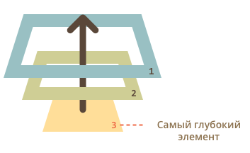
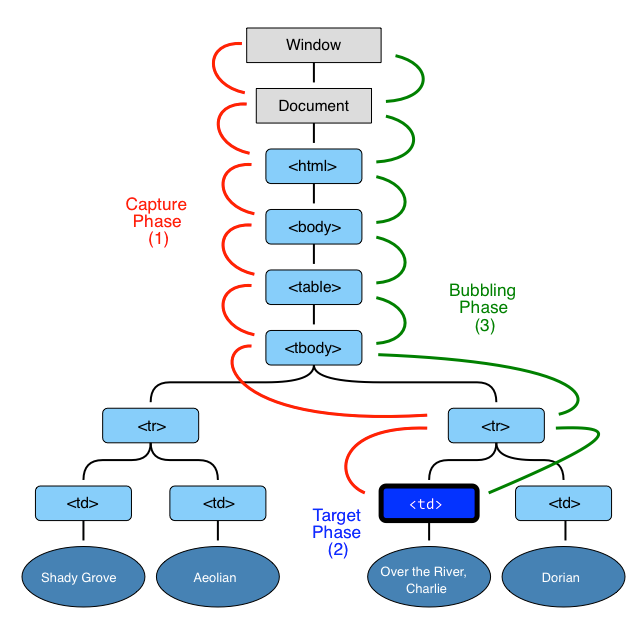

archive:
  ref: bubbling-and-capturing

---

# Всплытие и перехват

Давайте сразу начнём с примера.

Этот обработчик для `<div>` сработает, если вы кликните по вложенному тегу `<em>` или `<code>`:

```html autorun height=60
<div onclick="alert('Обработчик для Div сработал!')">
  <em>Кликните на <code>EM</code>, сработает обработчик на <code>DIV</code></em>
</div>
```

Вам не кажется это странным? Почему же сработал обработчик на `<div>`, если клик произошёл на `<em>`?

## Всплытие

Основной принцип всплытия:

**При наступлении события обработчики сначала срабатывают на самом вложенном элементе, затем на его родителе, затем выше и так далее, вверх по цепочке вложенности.**

Например, есть 3 вложенных элемента `FORM > DIV > P`, с обработчиком на каждом:

```html run autorun
<style>
  body * {
    margin: 10px;
    border: 1px solid blue;
  }
</style>

<form onclick="alert('form')">FORM
  <div onclick="alert('div')">DIV
    <p onclick="alert('p')">P</p>
  </div>
</form>
```

Всплытие гарантирует, что клик по внутреннему `<p>` вызовет обработчик `onclick` (если есть) сначала на самом `<p>`, затем на элементе `<div>` далее на элементе `<form>`, и так далее вверх по цепочке родителей до самого `document`.



Поэтому если в примере выше кликнуть на `P`, то последовательно выведутся `alert`: `p` -> `div` -> `form`.

Этот процесс называется *всплытием*, потому что события "всплывают" от внутреннего элемента вверх через родителей, подобно тому, как всплывает пузырек воздуха в воде.

```warn header="Всплывают *почти* все события."
Ключевое слово в этой фразе -- "почти".

Например, событие `focus` не всплывает. В дальнейших главах мы будем детально знакомиться с различными событиями и увидим ещё примеры.
```

## Целевой элемент event.target

На каком бы элементе мы ни поймали событие, всегда можно узнать, где конкретно оно произошло.

**Самый глубокий элемент, который вызывает событие, называется *"целевым"* или *"исходным"* элементом и доступен как `event.target`.**

Отличия от `this` (=`event.currentTarget`):

- `event.target` -- это **исходный элемент**, на котором произошло событие, в процессе всплытия он неизменен.
- `this` -- это **текущий элемент**, до которого дошло всплытие, на нём сейчас выполняется обработчик.

Например, если стоит только один обработчик `form.onclick`, то он "поймает" все клики внутри формы. Где бы ни был клик внутри -- он всплывёт до элемента `<form>`, на котором сработает обработчик.

При этом:

- `this` (`=event.currentTarget`) всегда будет сама форма, так как обработчик сработал на ней.
- `event.target` будет содержать ссылку на конкретный элемент внутри формы, самый вложенный, на котором произошёл клик.

[codetabs height=220 src="bubble-target"]

Возможна и ситуация, когда `event.target` и `this` -- один и тот же элемент, например если в форме нет других тегов и клик был на самом элементе `<form>`.

## Прекращение всплытия

Всплытие идёт прямо наверх. Обычно событие будет всплывать наверх и наверх, до элемента `<html>`, а затем до `document`, а иногда даже до `window`, вызывая все обработчики на своем пути.

**Но любой промежуточный обработчик может решить, что событие полностью обработано, и остановить всплытие.**

Для остановки всплытия нужно вызвать метод `event.stopPropagation()`.

Например, здесь при клике на кнопку обработчик `body.onclick` не сработает:

```html run autorun height=60
<body onclick="alert('сюда обработка не дойдёт')">
  <button onclick="event.stopPropagation()">Кликни меня</button>
</body>
```

```smart header="event.stopImmediatePropagation()"
Если у элемента есть несколько обработчиков на одно событие, то даже при прекращении всплытия все они будут выполнены.

То есть, `stopPropagation` препятствует продвижению события дальше, но на текущем элементе все обработчики отработают.

Для того, чтобы полностью остановить обработку, современные браузеры поддерживают метод `event.stopImmediatePropagation()`. Он не только предотвращает всплытие, но и останавливает обработку событий на текущем элементе.
```

```warn header="Не прекращайте всплытие без необходимости!"
Всплытие -- это удобно. Не прекращайте его без явной нужды, очевидной и архитектурно прозрачной.

Зачастую прекращение всплытия создаёт свои подводные камни, которые потом приходится обходить.

Например:

1. Мы делаем меню. Оно обрабатывает клики на своих элементах и делает для них `stopPropagation`. Вроде бы, всё работает.
2. Позже мы решили отслеживать все клики в окне, для какой-то своей функциональности, к примеру, для статистики -- где вообще у нас кликают люди. Например, Яндекс.Метрика так делает, если включить соответствующую опцию.
3. Над областью, где клики убиваются `stopPropagation`, статистика работать не будет! Получилась "мёртвая зона".

Проблема в том, что `stopPropagation` убивает всякую возможность отследить событие сверху, а это бывает нужно для реализации чего-нибудь "эдакого", что к меню отношения совсем не имеет.
```

## Погружение

В современном стандарте, кроме "всплытия" событий, предусмотрено ещё и "погружение".

Оно гораздо менее востребовано, но иногда, очень редко, знание о нём может быть полезным.

Строго говоря, стандарт выделяет целых три стадии прохода события:

1. Событие сначала идет сверху вниз. Эта стадия называется *"стадия перехвата"* (capturing stage).
2. Событие достигло целевого элемента. Это -- *"стадия цели"* (target stage).
3. После этого событие начинает всплывать. Это -- *"стадия всплытия"* (bubbling stage).

В [стандарте DOM Events 3](http://www.w3.org/TR/DOM-Level-3-Events/) это продемонстрировано так:



То есть, при клике на `TD` событие путешествует по цепочке родителей сначала вниз к элементу ("погружается"), а потом наверх ("всплывает"), по пути задействуя обработчики.

**Ранее мы говорили только о всплытии, потому что другие стадии, как правило, не используются и проходят незаметно для нас.**

Обработчики, добавленные через `on...`-свойство, ничего не знают о стадии перехвата, а начинают работать со всплытия.

Чтобы поймать событие на стадии перехвата, нужно использовать третий аргумент `addEventListener`:

- Если аргумент `true`, то событие будет перехвачено по дороге вниз.
- Если аргумент `false`, то событие будет поймано при всплытии.

Стадия цели, обозначенная на рисунке цифрой `(2)`, особо не обрабатывается, так как обработчики, назначаемые обоими этими способами, срабатывают также на целевом элементе.

```smart header="Есть события, которые не всплывают, но которые можно перехватить"
Бывают события, которые можно поймать только на стадии перехвата, а на стадии всплытия -- нельзя..

Например, таково событие фокусировки на элементе [onfocus](/focus-blur). Конечно, это большая редкость, такое исключение существует по историческим причинам.
```

## Примеры

В примере ниже на `<form>`, `<div>`, `<p>` стоят те же обработчики, что и раньше, но на этот раз -- на стадии погружения. Чтобы увидеть перехват в действии, кликните в нём на элементе `<p>`:

[codetabs height=220 src="capture"]

Обработчики сработают в порядке "сверху-вниз": `FORM` -> `DIV` -> `P`.

JS-код здесь такой:

```js
var elems = document.querySelectorAll('form,div,p');

// на каждый элемент повесить обработчик на стадии перехвата
for (var i = 0; i < elems.length; i++) {
  elems[i].addEventListener("click", highlightThis, true);
}
```

Никто не мешает назначить обработчики для обеих стадий, вот так:

```js
var elems = document.querySelectorAll('form,div,p');

for (var i = 0; i < elems.length; i++) {
  elems[i].addEventListener("click", highlightThis, true);
  elems[i].addEventListener("click", highlightThis, false);
}
```

Кликните по внутреннему элементу `<p>`, чтобы увидеть порядок прохода события:

[codetabs height=220 src="both"]

Должно быть `FORM` -> `DIV` -> `P` -> `P` -> `DIV` -> `FORM`. Заметим, что элемент `<p>` участвует в обоих стадиях.

Как видно из примера, один и тот же обработчик можно назначить на разные стадии. При этом номер текущей стадии он, при необходимости, может получить из свойства `event.eventPhase` (=1, если погружение, =3, если всплытие).

## Отличия IE8-

Чтобы было проще ориентироваться, я собрал отличия IE8-, которые имеют отношение ко всплытию, в одну секцию.

Их знание понадобится, если вы решите писать на чистом JS, без фреймворков и вам понадобится поддержка IE8-.

Нет свойства `event.currentTarget`
: Обратим внимание, что при назначении обработчика через `onсвойство` у нас есть `this`, поэтому `event.currentTarget`, как правило, не нужно, а вот при назначении через `attachEvent` обработчик не получает `this`, так что текущий элемент, если нужен, можно будет взять лишь из замыкания.

Вместо `event.target` в IE8- используется `event.srcElement`
: Если мы пишем обработчик, который будет поддерживать и IE8- и современные браузеры, то можно начать его так:

    ```js
    elem.onclick = function(event) {
      event = event || window.event;
      var target = event.target || event.srcElement;

      // ... теперь у нас есть объект события и target
      ...
    }
    ```

Для остановки всплытия используется код `event.cancelBubble=true`.
: Кросс-браузерно остановить всплытие можно так:

    ```js no-beautify
    event.stopPropagation ? event.stopPropagation() : (event.cancelBubble=true);
    ```

Далее в учебнике мы будем использовать стандартные свойства и вызовы, поскольку добавление этих строк, обеспечивающих совместимость -- достаточно простая и очевидная задача. Кроме того, никто не мешает подключить полифил.

Ещё раз хотелось бы заметить -- эти отличия нужно знать при написании JS-кода с поддержкой IE8- без фреймворков. Почти все JS-фреймворки обеспечивают кросс-браузерную поддержку `target`, `currentTarget` и `stopPropagation()`.

## Итого

Алгоритм:

- При наступлении события -- элемент, на котором оно произошло, помечается как "целевой" (`event.target`).
- Далее событие сначала двигается вниз от корня документа к `event.target`, по пути вызывая обработчики, поставленные через `addEventListener(...., true)`.
- Далее событие двигается от `event.target` вверх к корню документа, по пути вызывая обработчики, поставленные через `on*` и `addEventListener(...., false)`.

Каждый обработчик имеет доступ к свойствам события:

- `event.target` -- самый глубокий элемент, на котором произошло событие.
- `event.currentTarget` (=`this`) -- элемент, на котором в данный момент сработал обработчик (до которого "доплыло" событие).
- `event.eventPhase` -- на какой фазе он сработал (погружение =1, всплытие = 3).

Любой обработчик может остановить событие вызовом `event.stopPropagation()`, но делать это не рекомендуется, так как в дальнейшем это событие может понадобиться, иногда для самых неожиданных вещей.

В современной разработке стадия погружения используется очень редко.

Этому есть две причины:

1. Историческая -- так как IE лишь с версии 9 в полной мере поддерживает современный стандарт.
2. Разумная -- когда происходит событие, то разумно дать возможность первому сработать обработчику на самом элементе, поскольку он наиболее конкретен. Код, который поставил обработчик именно на этот элемент, знает максимум деталей о том, что это за элемент, чем он занимается.

    Далее имеет смысл передать обработку события родителю -- он тоже понимает, что происходит, но уже менее детально, далее -- выше, и так далее, до самого объекта `document`, обработчик на котором реализовывает самую общую функциональность уровня документа.

